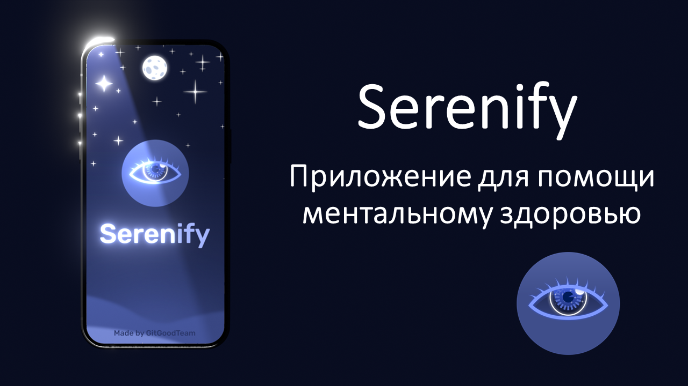
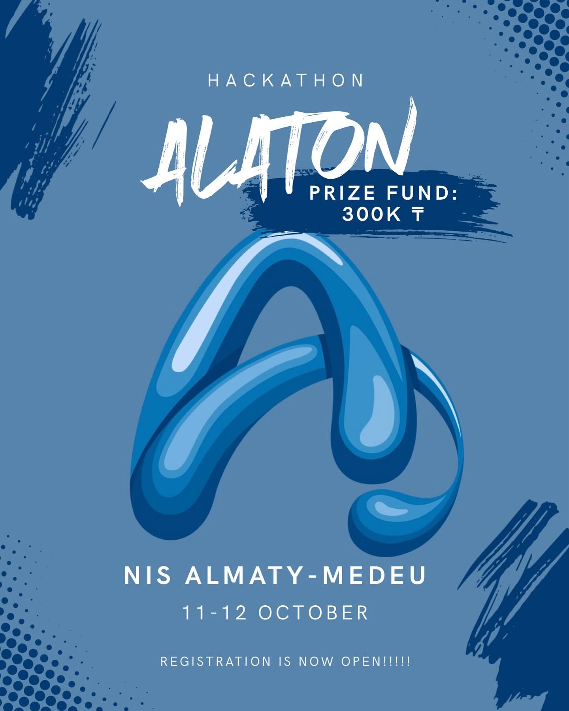
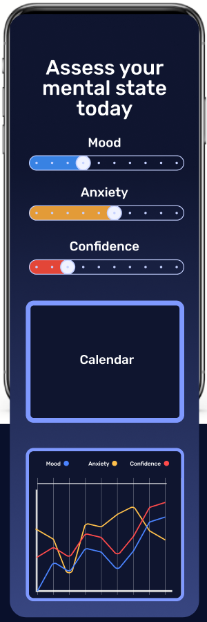

# Serenify

A prototype app created at the **ALATON (Almaty Hackathon 2025)** hackathon to simplify access to psychological support.

It was created in just a few hours together with my friends. We didn’t have time to finish everything we planned, but overall I’m proud of our work. A lot was built from scratch in such a short time.

The main idea of the app was to make it easy to find the right doctor, call them directly through the app, and track your mental health daily to see your progress and statistics.

We've only managed to implement the initial design and structure of the app, and I want to capture that. Only Russian language is supported

## Getting Started

This project is a starting point for a Flutter application.

A few resources to get you started if this is your first Flutter project:

- [Lab: Write your first Flutter app](https://docs.flutter.dev/get-started/codelab)
- [Cookbook: Useful Flutter samples](https://docs.flutter.dev/cookbook)

For help getting started with Flutter development, view the
[online documentation](https://docs.flutter.dev/), which offers tutorials,
samples, guidance on mobile development, and a full API reference.

###### Made by GitGood Team (nicehack, 3ydik,  Niver, Azizik1)